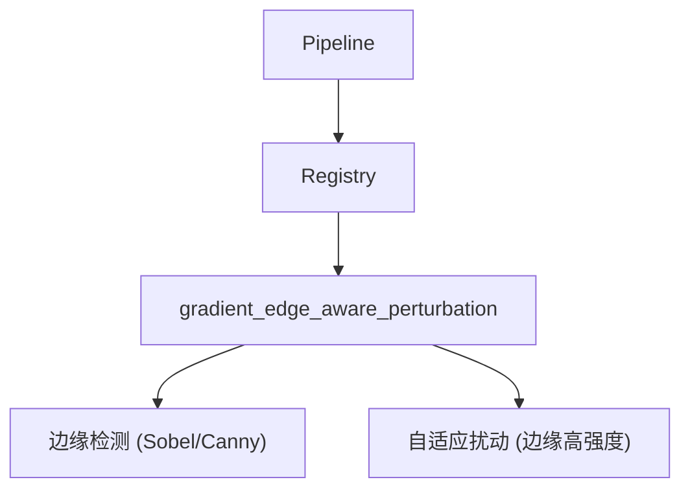

# Phase 10.3：Gradient/Edge-aware Perturbation (梯度/边缘感知扰动) 方法族

## PRD

### Problem Statement

当前 `noise` 和 `pixel` 模块进行的是全局或随机扰动，但检测器（如 aiphotocheck.com）依赖的 **Gradient Analysis**（梯度分析）主要检测边缘和纹理区域的异常过渡。现有模块缺乏对边缘/纹理区域的**针对性优先扰动**能力，无法最大化对梯度特征的破坏。

### Solution

新增 `gradient_edge_aware_perturbation` 方法族，在进行像素或噪声扰动时，优先在边缘和纹理区域进行，以最大化对梯度特征的破坏。

### User Stories

1. 作为测试者，我希望能单独开启该方法族，验证其对 Gradient Analysis 的对抗效果。
2. 作为研究者，我希望支持基于边缘检测（Canny/Sobel）的自适应扰动，并可配置边缘权重。
3. 作为用户，我希望该方法族可与画质优先模式和 DIL 闭环配合使用。

### Implementation Decisions

- 新建 `src/transform_core/modules/gradient_edge_aware_perturbation.py`，继承 `TransformModule`。
- 名称：`"gradient_edge_aware_perturbation"`，自动注册。
- 支持 `TransformConfig` 新字段：
  - `gradient_edge_aware_perturbation_enabled`
  - `gradient_edge_aware_perturbation_edge_weight`
  - `gradient_edge_aware_perturbation_smooth_weight`
- 核心：使用边缘检测算子识别边缘/纹理区域，然后在这些区域施加更高强度的扰动。
- 与现有 `noise` 模块保持边界清晰（一个是全局扰动，一个是边缘感知扰动）。

### Testing Decisions

- 手动测试单方法族场景。
- 验证 manifest 记录。
- 测试与画质优先模式兼容性。

### Out of Scope

- 基于学习的边缘检测
- 针对特定检测器梯度特征的分析
- 大规模 benchmark

### Further Notes

该模块为**专项对抗工具**，旨在精确打击 Gradient Analysis 检测方法，与现有的 `noise` 模块形成互补。

---

## Vertical Slices

### Slice P10.3-1：Module 骨架与注册

- **Type**: AFK
- **What to build**: 创建模块文件，实现 `name` 和 `apply` 接口，支持 surrogate 模式。
- **Acceptance criteria**:
  - [ ] 模块可注册
  - [ ] 仅启用该方法族时正常运行

### Slice P10.3-2：边缘检测与权重分配逻辑

- **Type**: AFK
- **Blocked by**: P10.3-1
- **What to build**: 实现边缘检测（Sobel/Canny）和边缘/平滑区域的权重分配。
- **Acceptance criteria**:
  - [ ] 支持边缘检测
  - [ ] 可配置边缘权重

### Slice P10.3-3：自适应扰动实现

- **Type**: AFK
- **Blocked by**: P10.3-2
- **What to build**: 实现基于权重的自适应像素/噪声扰动。
- **Acceptance criteria**:
  - [ ] 在边缘区域施加更高强度扰动

### Slice P10.3-4：Config 扩展与文档

- **Type**: AFK
- **Blocked by**: P10.3-3
- **What to build**: 更新 `TransformConfig`，添加 README 示例。
- **Acceptance criteria**:
  - [ ] 配置字段可用
  - [ ] README 有使用说明

---

## 架构图

## 关键文件

- `src/transform_core/modules/gradient_edge_aware_perturbation.py`（新建）
- `src/transform_core/config.py`（新增字段）
- `README.md`（更新示例）

## 预估

每个 Slice 2-4h，合计约 2 个工作日。
