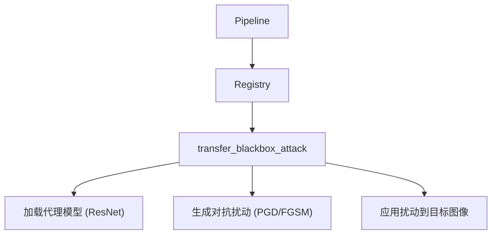

# Phase 10.4：Transfer-based Black-box Attack Framework (迁移性黑盒攻击框架) 方法族

## PRD

### Problem Statement

当前项目缺乏对 **ML Detection**（基于深度学习的检测器）的直接对抗能力。ML Detection 通常使用 CNN 或 ViT 模型来分类图像。现有模块（如 LPIPS）依赖于感知损失或零阶优化（SPSA），缺乏利用**代理模型（Surrogate Model）**生成迁移性对抗样本的能力。

### Solution

新增 `transfer_blackbox_attack` 方法族，建立一个框架，允许用户指定一个或多个开源的代理检测模型。框架将使用梯度-based 攻击算法（如 PGD）在代理模型上生成对抗扰动，并将该扰动应用于目标图像，以欺骗未知的目标检测器。

### User Stories

1.  作为测试者，我希望能指定一个代理模型（例如 ResNet50），并生成针对该模型的对抗样本，以测试其对未知 ML 检测器的迁移性。
2.  作为研究者，我希望支持多种攻击算法（FGSM, PGD, BIM）并可配置扰动预算（epsilon）。
3.  作为用户，我希望该框架可以与画质优先模式和 DIL 闭环配合使用。

### Implementation Decisions

- 新建 `src/transfer_attack/` 子包，包含攻击逻辑和代理模型加载器。
- 新建 `src/transform_core/modules/transfer_blackbox_attack.py`，继承 `TransformModule`。
- 名称：`"transfer_blackbox_attack"`，自动注册。
- 支持 `TransformConfig` 新字段：
  - `transfer_blackbox_attack_enabled`
  - `transfer_blackbox_attack_surrogate_model` (e.g., "resnet50")
  - `transfer_blackbox_attack_algorithm` (fgsm, pgd, bim)
  - `transfer_blackbox_attack_epsilon`
- 核心：实现代理模型加载、梯度计算和扰动生成。
- 注意：此模块需要 PyTorch 环境。

### Testing Decisions

- 手动测试单方法族场景（需 torch）。
- 验证 manifest 记录。
- 测试与画质优先模式兼容性。

### Out of Scope

- 实现查询-based 黑盒攻击（无需代理模型）
- 自动化代理模型训练
- 大规模 benchmark

### Further Notes

该模块为**框架型工具**，旨在提供迁移性黑盒攻击能力，精确对抗 ML Detection 检测方法。它与现有的 LPIPS 黑盒（SPSA）形成互补（一个是梯度-based，一个是零阶优化）。

---

## Vertical Slices

### Slice P10.4-1：Module 骨架与注册

- **Type**: AFK
- **What to build**: 创建模块文件和子包结构，实现 `name` 和 `apply` 接口，支持 surrogate 模式。
- **Acceptance criteria**:
  - [ ] 模块可注册
  - [ ] 仅启用该方法族时正常运行（无 torch 时降级）

### Slice P10.4-2：代理模型加载与攻击逻辑

- **Type**: AFK
- **Blocked by**: P10.4-1
- **What to build**: 实现代理模型加载（torchvision）和 PGD/FGSM 攻击逻辑。
- **Acceptance criteria**:
  - [ ] 支持 ResNet50 等代理模型
  - [ ] 可生成对抗样本

### Slice P10.4-3：扰动应用与集成

- **Type**: AFK
- **Blocked by**: P10.4-2
- **What to build**: 将生成的扰动应用于目标图像，并集成到 TransformConfig。
- **Acceptance criteria**:
  - [ ] 扰动可被正确应用

### Slice P10.4-4：Config 扩展与文档

- **Type**: AFK
- **Blocked by**: P10.4-3
- **What to build**: 更新 `TransformConfig`，添加 README 示例。
- **Acceptance criteria**:
  - [ ] 配置字段可用
  - [ ] README 有使用说明

---

## 架构图

## 关键文件

- `src/transform_core/modules/transfer_blackbox_attack.py`（新建）
- `src/transfer_attack/`（新建子包）
- `src/transform_core/config.py`（新增字段）
- `README.md`（更新示例）

## 预估

每个 Slice 3-5h，合计约 3 个工作日（因涉及 PyTorch 集成）。
