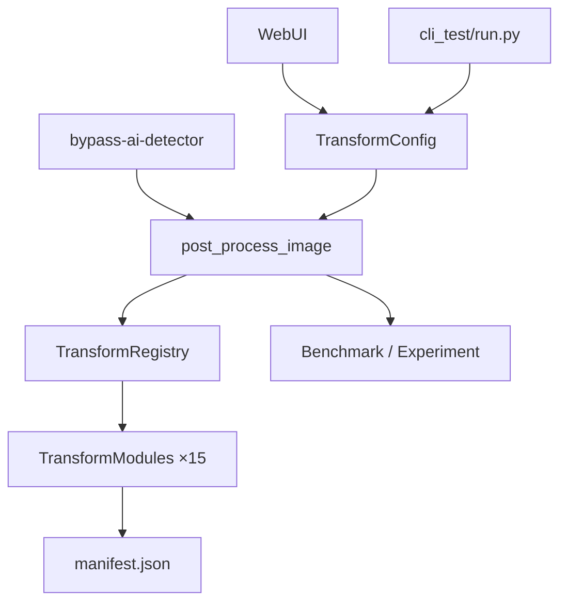

# AI Image Detection Bypass Framework

模块化对抗评估框架，面向**内部鲁棒性评估**与**实验性对抗能力**研究。提供 TransformConfig 管道、WebUI/CLI 测试入口、Benchmark/Experiment 评估链路与可选的外部平台验证接口。

> 能力成熟度见下表。未标注为「可用」的能力不应作为生产级对抗验收依据。

## 当前进度（2026-06）

- **15 项方法族**可单项 CLI 测试（`cli_test/run.py --methods <name>`），自动同步 `*_enabled` 标志
- **WebUI** 已集成 P9/P10 四模块参数面板 + LPIPS/水印/重生成勾选
- **verified 默认参数**已写入 `TransformConfig`（见 `cli_test/TEST_SETTINGS.md`）
- **外部检测验证**：camera / noise / texture 单项降幅约 20%；其余方法族小幅有效（详见飞书 Wiki 第 4 节模板）
- 文档：[用户使用指南](docs/USER_GUIDE.md) · [单项测试参数](cli_test/TEST_SETTINGS.md) · [Wiki 表格模板](docs/LARK_WIKI_SECTION4_TABLE.md)

## 能力成熟度矩阵

| 功能项 | 成熟度 | 说明 |
|---|---|---|
| TransformConfig + TransformModule + Registry | 可用 | 核心配置与注册表；manifest 记录完整 module_parameters |
| 15 个方法族（单项 CLI） | 可用 | 见下方「方法族一览」；`cli_test/` 快速验证 |
| Metadata / EXIF | 可用 | copy/strip/synthetic；无 C2PA/provenance |
| Encoding / JPEG / resize | 可用 | 本地鲁棒性变换 |
| Noise / pixel perturbation | 可用 | 单项测试效果较好 |
| Frequency / FFT | 可用 | FFT 频域扰动 |
| Texture / GLCM-LBP | 可用 | 单项测试效果较好 |
| Camera / recapture | 可用 | 相机管线 + 多轮 JPEG；单项测试效果较好 |
| Regeneration surrogate | 可用 | 代理重生成（无生成模型） |
| 真实 img2img regeneration | 实验性 | 需 torch+diffusers+模型路径；否则回退 surrogate |
| LPIPS 非语义攻击 | 实验性 | 无 detector 时用 ResNet50 PGD + 像素混合；需 torch |
| SynthID / watermark removal | 实验性 | V3 中高频频谱衰减；无 codebook 时回退策略 |
| Frequency Peaks Cleansing | 实验性 | 8×8 DCT 峰值衰减（已修复全局 DCT 纯黑图问题） |
| PRNU Simulation/Removal | 实验性 | 支持参考图提取；无参考图时自生成指纹 |
| Gradient/Edge-aware Perturbation | 实验性 | 边缘感知扰动 |
| Transfer-based Black-box Attack | 实验性 | FGSM/PGD + ResNet；需 torch；注意输出尺寸 |
| Diffusion Reconstruction | 实验性 | 需 diffusers + 模型；否则 surrogate no-op |
| Detector-in-the-Loop | 实验性 | 真实闭环结构；mock/真实 Adapter 均支持 |
| Hive 外部验证 | 实验性 | HTTP 客户端；需 API key |
| Benchmark / Experiment | 可用 | Wilson CI、失败案例导出 |
| WebUI | 可用 | Gradio；方法族多选 + P9/P10 参数 + LPIPS 控件 |
| CLI 打包入口 | 可用 | `bypass-ai-detector`、`benchmark` |
| `cli_test/` 工作区 | 可用 | 单方法族批量测试 + manifest |

## 方法族一览（15 项）

| CLI `--methods` | 类别 | 说明 |
|---|---|---|
| `metadata` | 基础 | EXIF 注入/剥离 |
| `encoding` | 基础 | JPEG、几何与色彩变换 |
| `noise` | 基础 | 高斯噪声 + 像素微扰 |
| `frequency` | 基础 | FFT 频域扰动 |
| `texture` | 基础 | GLCM/LBP 纹理整形 |
| `camera` | 基础 | 相机/重拍模拟 |
| `regeneration_surrogate` | 重生成 | 代理重生成 |
| `regeneration` | 重生成 | 真实 img2img（需模型） |
| `lpips` | 对抗 | LPIPS / ResNet 代理攻击 |
| `watermark` | 对抗 | SynthID 频谱去除 |
| `frequency_peaks_cleansing` | P9/P10 | 频谱峰值清洗 |
| `prnu_simulation` | P9/P10 | PRNU 模拟/去除 |
| `gradient_edge_aware_perturbation` | P10.3 | 边缘感知扰动 |
| `transfer_blackbox_attack` | P10.4 | 迁移黑盒攻击 |
| `diffusion_reconstruction` | P9 | 扩散重建（SynthID） |

## 快速开始

### 安装

```bash
pip install -e .              # 核心
pip install -e ".[dev]"       # 开发（pytest、ruff、black）
pip install -e ".[full]"      # 含 LPIPS（torch）
```

### 单方法族快速测试（推荐）

```bash
# 将测试图放入 cli_test/images/
cd cli_test
python run.py --methods camera --seed 42 --quality 90
# 输出 → cli_test/outputs/<图名>-camera.jpg + manifest
```

```bash
# 测试 P9/P10 模块
python run.py --methods frequency_peaks_cleansing,prnu_simulation
python run.py --methods prnu_simulation --prnu-ref /path/to/ref.jpg  # 可选参考图
```

### WebUI

```bash
export PYTHONPATH=src
python webui_bypass.py
# → http://127.0.0.1:7860
```

勾选方法族后处理；P9/P10 有独立参数 Accordion，LPIPS 有强度/步数控件。

### 传统 CLI / Benchmark

```bash
make test

bypass-ai-detector --input data/benchmark_samples/sample.jpg --output /tmp/out.jpg --profile quick

bypass-ai-detector --input input.jpg --output output.jpg --profile adversarial

benchmark --mode=experiment --platforms remote:mock --samples 20 --output-dir exp_results
```

## 项目结构

```
src/
├── transform_core/          # TransformConfig + Registry + Modules + Pipeline
├── lpips_attack/            # LPIPS / ResNet 代理攻击
├── synthid_removal/         # SynthID 水印移除（V3）
├── detector_loop/           # Detector-in-the-Loop
├── external_validation/     # Hive / Mock 外部验证
└── benchmark/               # BenchmarkRunner + Experiment
cli_test/                    # 单方法族测试工作区（images/ outputs/ run.py）
docs/
├── USER_GUIDE.md            # WebUI + CLI 完整指南
└── LARK_WIKI_SECTION4_TABLE.md  # 15 项单项测试表（飞书粘贴用）
tests/
webui_bypass.py              # Gradio WebUI 入口
bypass_ai_detector.py        # Legacy CLI 入口
```

## 文档

| 文档 | 用途 |
|---|---|
| [docs/USER_GUIDE.md](docs/USER_GUIDE.md) | WebUI/CLI 运行、方法族、FAQ |
| [cli_test/README.md](cli_test/README.md) | `cli_test/` 用法 |
| [cli_test/TEST_SETTINGS.md](cli_test/TEST_SETTINGS.md) | verified 默认参数 |
| [docs/LARK_WIKI_SECTION4_TABLE.md](docs/LARK_WIKI_SECTION4_TABLE.md) | 单项测试效果记录表 |

## 架构概览



## 如何添加新 TransformModule

1. 在 `src/transform_core/modules/` 下创建模块文件
2. 继承 `TransformModule`，实现 `name` 与 `apply`
3. 底部调用 `register_module(...)`，并在 `modules/__init__.py` 导入
4. 若需 CLI 单项测试，在 `cli_test/run.py` 的 `method_enabled_flags` 中补充 `*_enabled` 映射

详见 [CONTRIBUTING.md](CONTRIBUTING.md)。

## License

MIT

## 贡献

欢迎提交 Issue 和 PR！详见 [CONTRIBUTING.md](CONTRIBUTING.md)。
