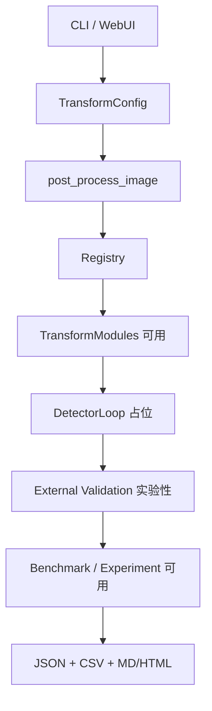

# AI Image Detection Bypass Framework

模块化对抗评估框架，面向**内部鲁棒性评估**与**实验性对抗能力**研究。提供 TransformConfig 管道、Benchmark/Experiment 评估链路与可选的外部平台验证接口。

> 能力成熟度见下表。未标注为「可用」的能力不应作为生产级对抗验收依据。

## 能力成熟度矩阵

| 功能项 | 成熟度 | 说明 |
|---|---|---|
| TransformConfig + TransformModule + Registry | 可用 | 核心配置与注册表可用；支持 adversarial profile（lpips+watermark+regeneration） |
| 7 个基础方法族 | 可用 | metadata/encoding/noise/frequency/texture/camera/regeneration_surrogate |
| Metadata / EXIF | 可用 | copy/strip/synthetic；无 C2PA/provenance |
| Encoding / JPEG / resize | 可用 | 本地鲁棒性变换，非 detector 优化 |
| Noise / pixel perturbation | 可用 | 固定强度扰动，非自适应攻击 |
| Frequency / FFT | 可用 | FFT 代理扰动，无频域目标优化 |
| Texture / GLCM-LBP | 可用 | GLCM/LBP-inspired 代理变换 |
| Camera / recapture | 实验性 | Bayer/moire 可选；镜头畸变为占位 |
| Regeneration surrogate | 可用 | `full` profile 默认使用代理重生成 |
| 真实 img2img regeneration | 实验性 | local diffusers 路径需 torch+模型；remote 未完整实现 |
| Detector-in-the-Loop | 实验性 | 真实闭环结构（detector.score + strength 动态调整 + 图像迭代）；mock 分数可用 |
| Hive 外部验证 | 实验性 | HTTP 客户端已实现；需 API key 做真实 e2e |
| LPIPS 非语义攻击 | 可用（黑盒路径） | 需 torch；支持黑盒优化（SPSA），`detector_feedback=True` 时自动启用；梯度路径保留 |
| SynthID / watermark removal | 实验性 | 简化 FFT 策略；通过 `profile=adversarial` 或 `watermark_remove=True` 接入 |
| Benchmark / Experiment | 可用 | 报告生成、Wilson CI、失败案例导出 |
| CLI 打包入口 | 可用 | `bypass-ai-detector`、`benchmark` |
| WebUI MVP | 实验性 | 基础 Gradio；无 LPIPS/水印/DIL 等高级控件 |

**成熟度定义**：**可用** = 无 torch 可跑且有测试；**实验性** = 接口存在、部分路径可用或需可选依赖；**占位** = 骨架/模拟逻辑。

## 功能特性

- **模块化变换管道**：`TransformConfig` + `TransformModule` 注册表，7 种核心方法族。
- **Detector-in-the-Loop**（实验性）：`detector_feedback=True` 触发真实闭环（detector.score + StrengthOverride 迭代 + 图像更新），mock/真实 Adapter 均支持。
- **SynthID 水印移除**（占位）：`synthid_removal` 子包提供实验性 SpectralCodebook + V3 策略。
- **LPIPS 非语义攻击**（实验性）：`lpips_attack` 子包，需 `pip install -e ".[lpips]"`。
- **外部平台验证**（实验性）：`external_validation` 支持 Hive API + Mock 降级 + Quota Guard。
- **Benchmark + Experiment 模式**（可用）：批量评估、Wilson CI、失败案例导出。

## 快速开始

### 安装

```bash
# 核心依赖
pip install -e .

# 开发环境（包含 pytest、ruff、black）
pip install -e ".[dev]"

# 完整安装（包含 LPIPS 依赖）
pip install -e ".[full]"
```

### 快速验证（核心链路）

```bash
# 1. 运行测试套件
make test

# 2. Experiment 模式（mock 平台 + Wilson CI）
make experiment

# 3. 单张图像处理
bypass-ai-detector --input data/benchmark_samples/sample.jpg --output /tmp/out.jpg --profile quick

# 4. Adversarial profile（LPIPS + 水印 + 重生成）
bypass-ai-detector --input data/benchmark_samples/sample.jpg --output /tmp/out_adv.jpg --profile adversarial
```

### CLI 工具

安装后可直接使用两个命令行入口：

```bash
# 1) 图像变换（推荐 --input/--output；positional 仍兼容）
bypass-ai-detector --input input.jpg --output output.jpg --profile full

# 2) Benchmark（默认 benchmark 模式）
benchmark --input-dir data/benchmark_samples --output-dir results --detector local:resnet50

# 3) Experiment 模式（mock 或 remote 平台）
benchmark --mode=experiment --platforms remote:mock --samples 50 --output-dir exp_results
```

## Experiment 模式示例

```bash
make experiment
# 或
PYTHONPATH=src benchmark --mode=experiment --platforms remote:mock --samples 20 --output-dir experiment_demo
```

输出：

- `experiment_results.json`：bypass rate + Wilson 95% CI + perceptual 均值
- `failure_cases.csv`：未能 bypass 的图像详情
- `summary.md`：人类可读总结

## 项目结构

```
src/
├── transform_core/          # 核心变换管道（TransformConfig + Registry + 7 Modules）
├── lpips_attack/            # LPIPS 非语义攻击（实验性，可选 torch）
├── synthid_removal/         # SynthID 水印移除（占位）
├── detector_loop/           # Detector-in-the-Loop 框架（占位）
├── external_validation/     # 外部平台验证（实验性）
└── benchmark/               # BenchmarkRunner + Experiment + 报告
tests/
data/benchmark_samples/      # 示例图像
scripts/                     # 一键实验脚本
notebooks/                   # Colab demo
```

## 如何添加新 TransformModule

1. 在 `src/transform_core/modules/` 下创建 `my_new_module.py`
2. 继承 `TransformModule`，实现 `name` 属性和 `apply` 方法
3. 文件底部调用 `register_module(MyNewModule())`
4. 更新 `PROFILE_METHODS`（如需要）

详见 `CONTRIBUTING.md`。

## 架构概览



## License

MIT

## 贡献

欢迎提交 Issue 和 PR！详见 `CONTRIBUTING.md`。
